# Why Segment Tree?
- Used to run Range sum query
- I.e. sum of all nums for given range
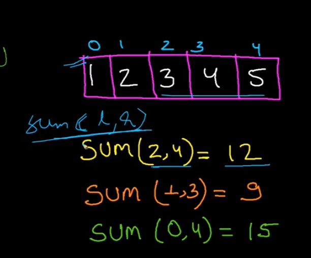
- Prefix sum is used to get the range sum query
- Prefix sum approach doesn't work well if input array is keep getting mutated
- Segment tree is used when input is frequently get mutated
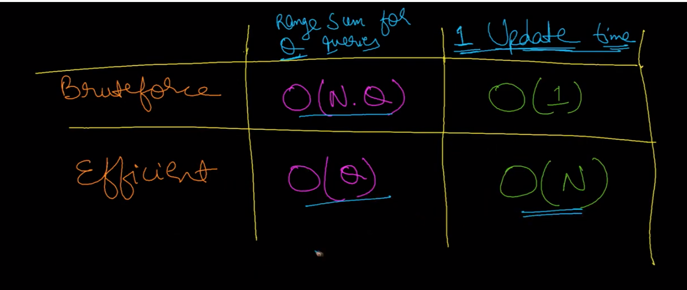
- Also used to run range min query
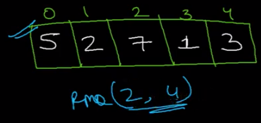
# Construct Segment tree
- Use partition algo of merge sort to partition array into fragments
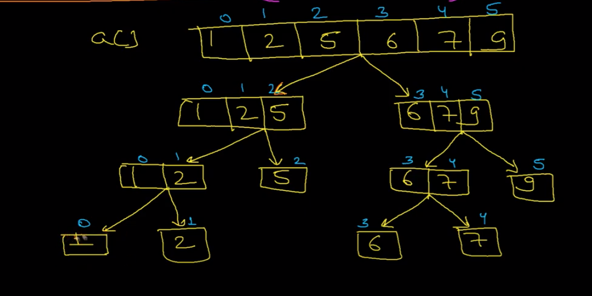
- After partition, we will return value from leaf to parent
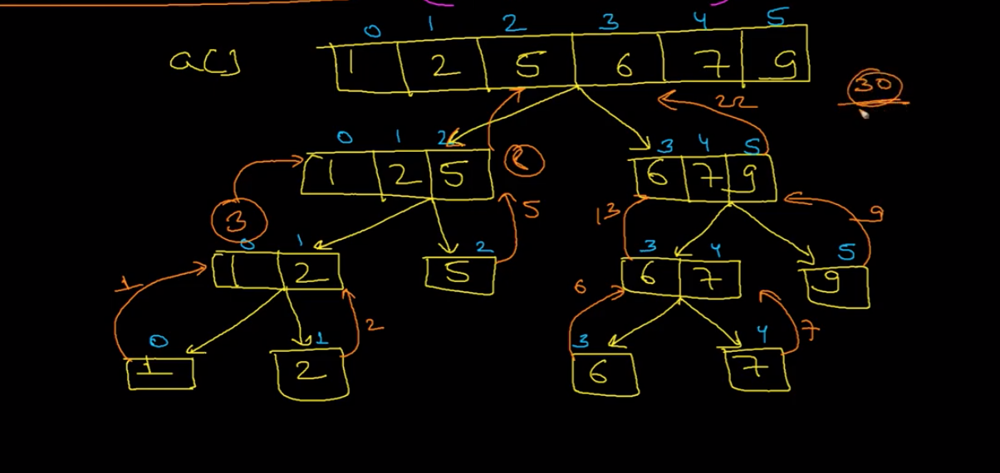
- Segment tree will be constructed as below
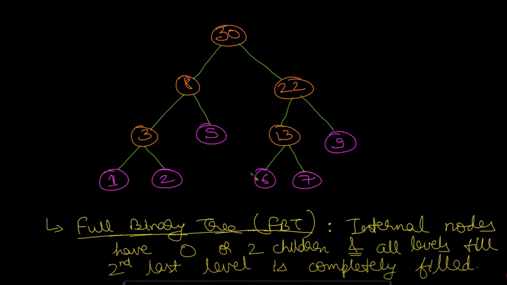
- Use array to store segment tree, similar to Heap

- Construct segment tree 
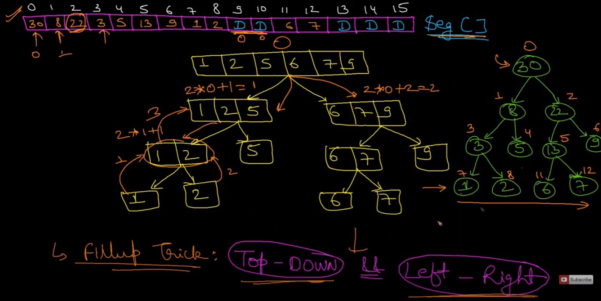
- Algorithm to construct segment tree
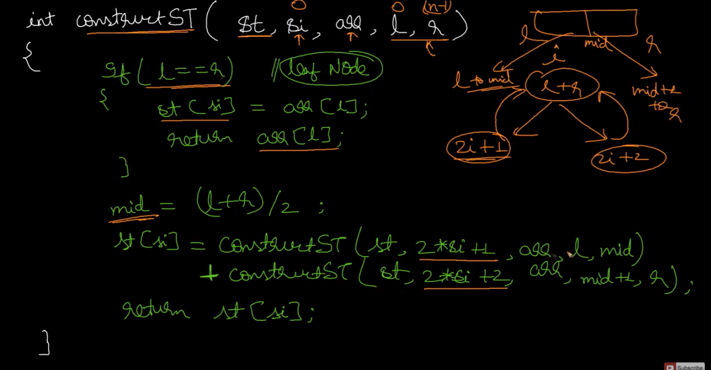
# Segment tree theory
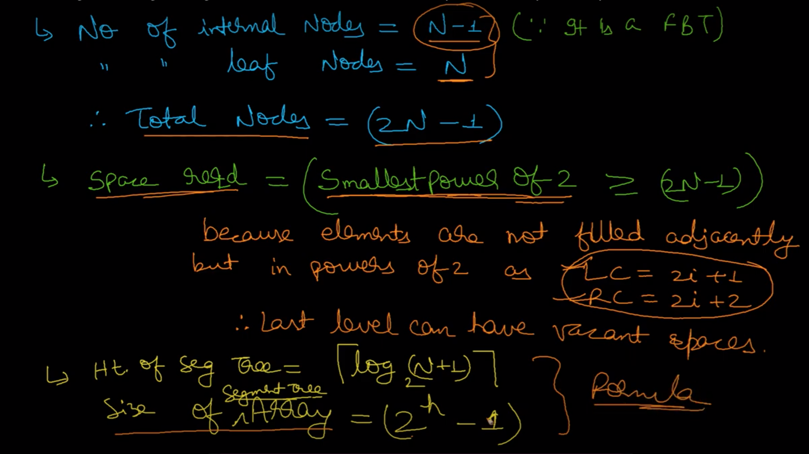
# Find Range Sum
- There are three types of overlap
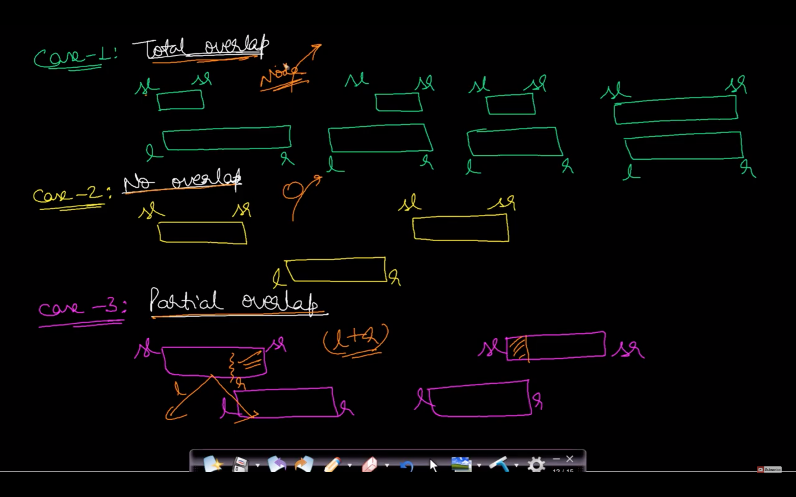
- Find range sum flow
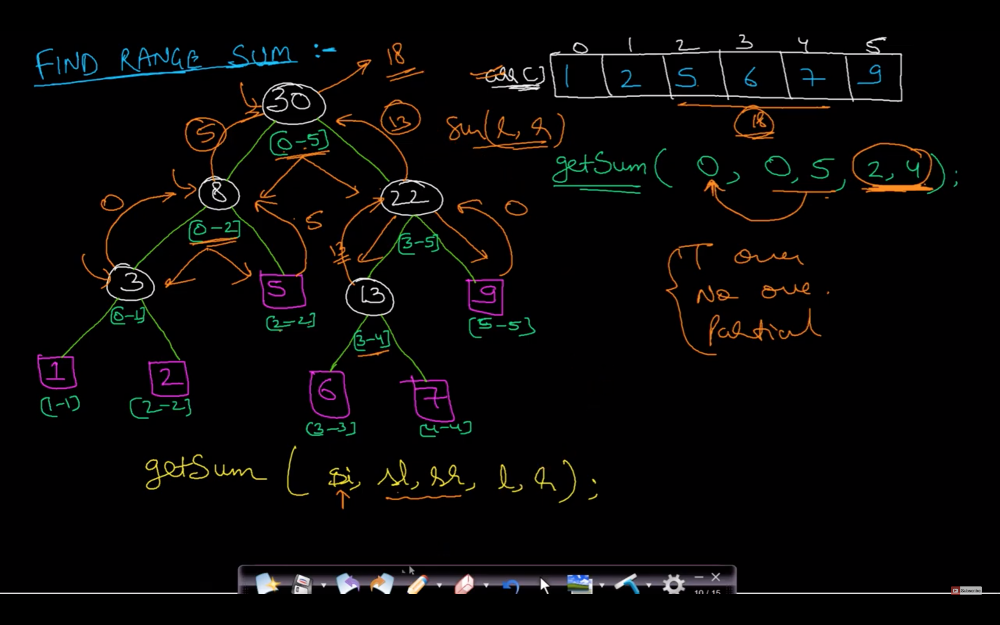
- Find range sum algo
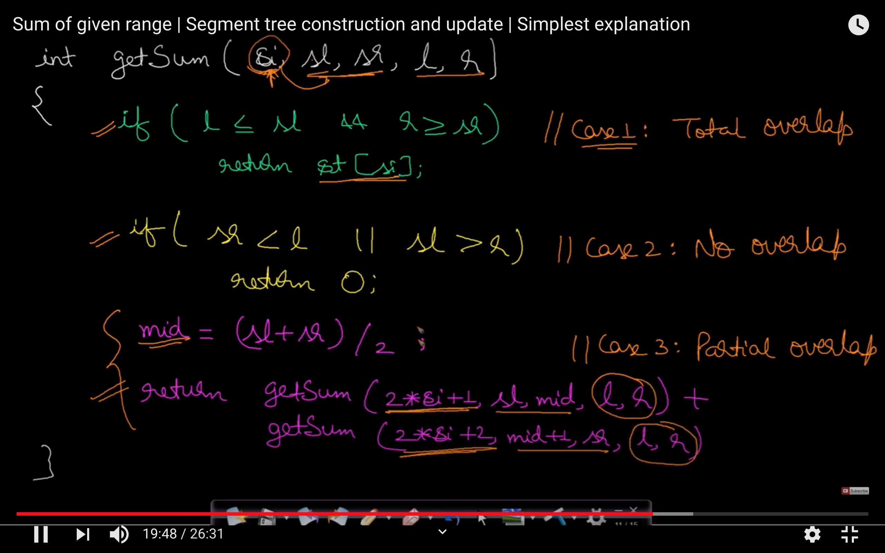
# Update operation
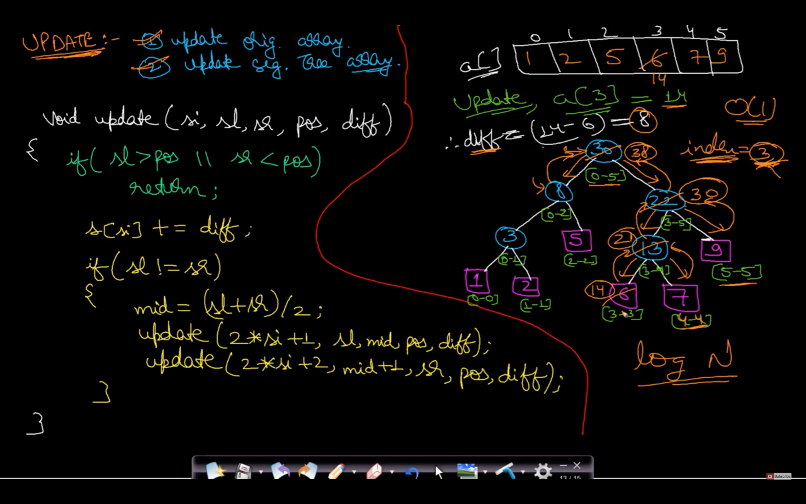
# Time complexity
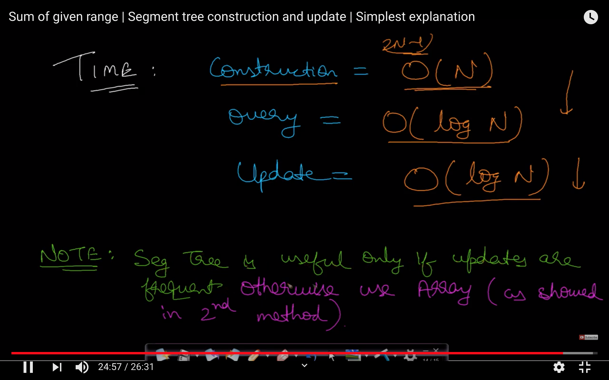
# Comparison
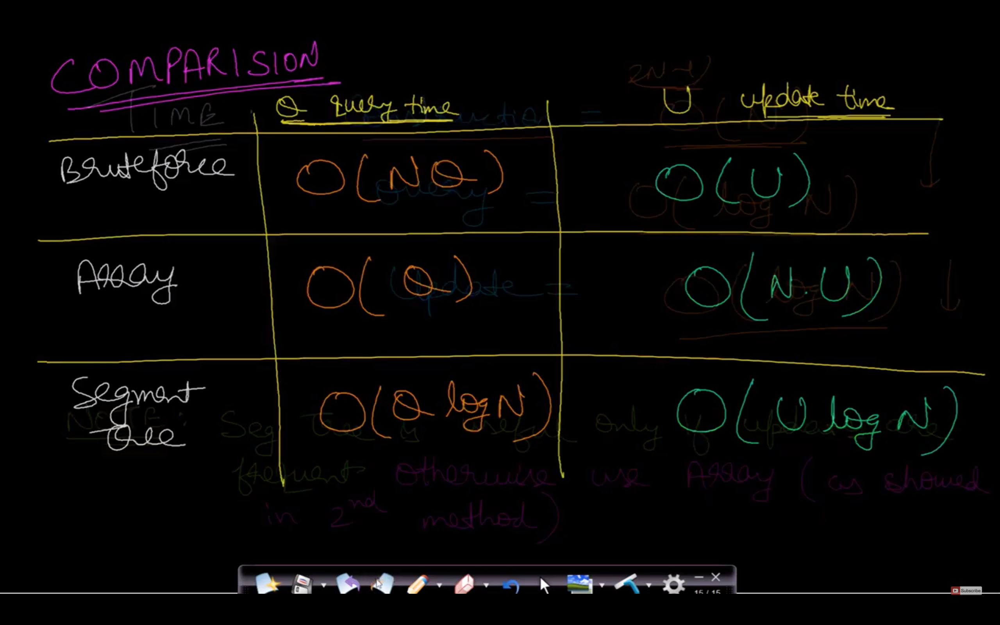

# Segment tree for min range query
- Instead of sum, get minimum while creating segment tree
- Instead of sum, use minimum while running range min query
- Instead of diff, use minimum while running update
# Two Dimensional Segment Tree | Sub-Matrix Sum
Given a rectangular matrix M[0…n-1][0…m-1], and queries are asked to find the sum / minimum / maximum on some sub-rectangles M[a…b][e…f], as well as queries for modification of individual matrix elements (i.e M[x] [y] = p ).

Algorithm :
We will build a two-dimensional tree of segments by the following principle:
1. In First step, We will construct an ordinary one-dimensional segment tree, working only with the first coordinate say ‘x’ and ‘y’ as constant. Here, we will not write number in inside the node as in the one-dimensional segment tree, but an entire tree of segments.

2. The second step is to combine the values of segmented trees. Assume that in second step instead of combining the elements we are combining the segment trees obtained from the step first.

Step 1 : We will first create the segment tree of each strip of y- axis. We repesent the segment tree here as an array where child node is 2n and 2n+1 where n > 0.

Segment Tree for strip y=1

Segment Tree for Strip y = 2

Segment Tree for Strip y = 3

Segment Tree for Strip y = 4

Step 2: In this step, we create the segment tree for the rectangular matrix where the base node are the strips of y-axis given above.The task is to merge above segment trees.

Sum Query :

# Range minimum query
- Find minimum value for given index range
    
- 
## Reference
https://www.youtube.com/watch?v=DpSYj7t1sbQ

# Problems
## 1d
https://leetcode.com/problems/range-sum-query-mutable/
## 2d
https://leetcode.com/problems/range-sum-query-2d-mutable/
# Reference
https://www.youtube.com/watch?v=ZBHKZF5w4YU

https://www.youtube.com/watch?v=2bSS8rtFym4

https://www.geeksforgeeks.org/two-dimensional-segment-tree-sub-matrix-sum/