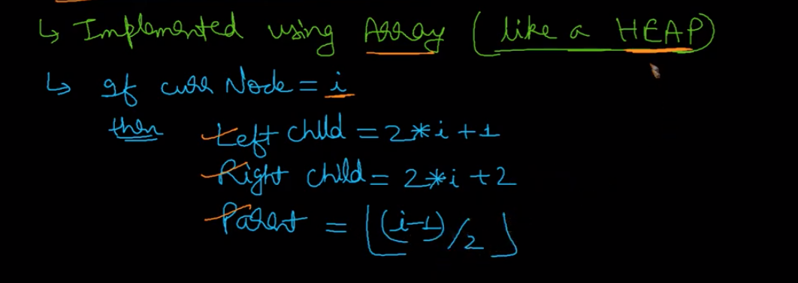

# Why Segment Tree?
- Used to run Range sum query
- I.e. sum of all nums for given range

- Prefix sum is used to get the range sum query
- Prefix sum approach doesn't work well if input array is keep getting mutated
- Segment tree is used when input is frequently get mutated

# Construct Segment tree
- Use partition algo of merge sort to partition array into fragments

- After partition, we will return value from leaf to parent

- Segment tree will be constructed as below

- Use array to store segment tree, similar to Heap

- Construct segment tree 

- Algorithm to construct segment tree

# Segment tree theory

# Find Range Sum
- There are three types of overlap

- Find range sum flow

- Find range sum algo

# Update operation

# Time complexity

# Comparison

# Problems

# Reference
https://www.youtube.com/watch?v=ZBHKZF5w4YU
https://www.youtube.com/watch?v=2bSS8rtFym4